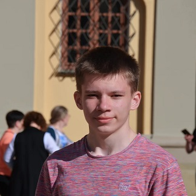

# Semion Zavaley


### **Contacts**
| phone | E-mail | Discord |
|-------|--------|---------|
| +375293203957 | obucheniekurs7@gmail.com | XxSMSxX#7022 |

## Briefly about me
My name is Semen, as you already read. I am 16 years old, and on July 31st I will be 17.

I study in the 11th grade of the district gymnasium, in Belarus. I have an average grade of 9.3.

I want to become a front-end developer. I enjoy studying at RS School. Before this, I studied a little bit of Python.

I love it when everything is logical and understandable. I am a perfectionist myself, but not too much.

I just like it when everything is beautiful. Good luck to everyone.
## Skills and Proficiency:
  * HTML, CSS
  * JavaScript
  * Git, GitHub
  * VS Code
## Code example:
### Python task:
*The program takes a string of text as input.*

*If the letter "f" appears only once in this string, output its index.*

*If it appears two or more times, output the index of its first and*

*last occurrence on the same line, separated by a space.*

*If the letter "f" does not appear in the string, output "NO".*
### Solution:
```
s = input()
chi = 0
if s.count('f') == 1:
    for i in range(len(s)):
        if s[i] != 'f':
            chi += 1
        else:
            break
    print(chi)
else:
    if s.count('f') != 0:
        print(s.find('f'), end = ' ')
        print(s.rfind('f'))
    else:
        print('NO')
```
## Experience :
***I am involved in a small project as a front-end developer.***
## Projects:
- **CV**
  - HTML
  - Git
  - CSS
  - Markdown
## Education:
***Kostyukovichi District State Gymnasium. Finished 10th grade.***
## Languages:
- Belorussian
- Russian
- English (A1)
